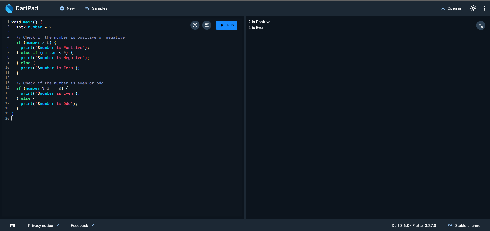

# Check Number: Positive or Negative and Even or Odd

## Description
This Dart program checks whether a given number is positive, negative, or zero and also determines if the number is even or odd.

## How to Run
1. Clone the repository or copy the `main.dart` file to your local system.
2. Navigate to the project directory in your terminal.
3. Run the program using the following command:
   ```bash
   dart run main.dart

   
## Example Output



## Code Explanation
1. **Initialization**:  
   The program assigns the value `2` to the `number` variable. You can replace this with any integer to test the program.

2. **Positive, Negative, or Zero Check**:  
   - If the number is greater than 0, it is classified as **Positive**.
   - If the number is less than 0, it is classified as **Negative**.
   - If the number equals 0, it is labeled as **Zero**.

3. **Even or Odd Check**:  
   - The program checks if the number is divisible by 2 using the modulus operator (`%`).
   - If `number % 2` equals 0, the number is classified as **Even**.
   - Otherwise, it is classified as **Odd**.

4. **Output**:  
   The results are displayed using the `print` function.
